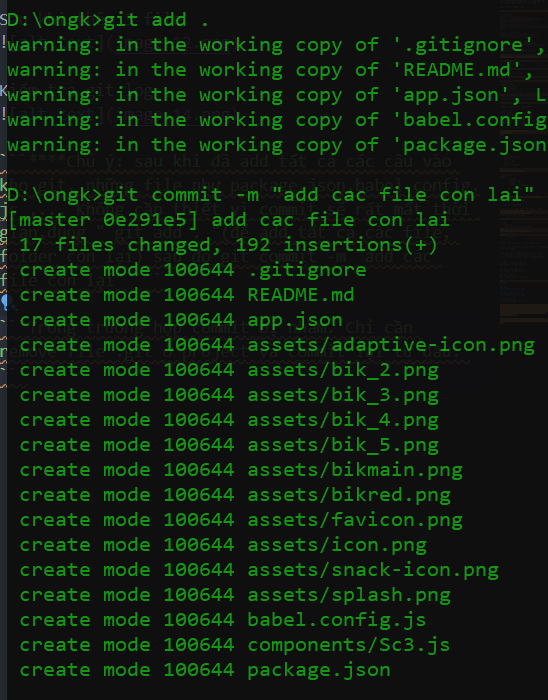
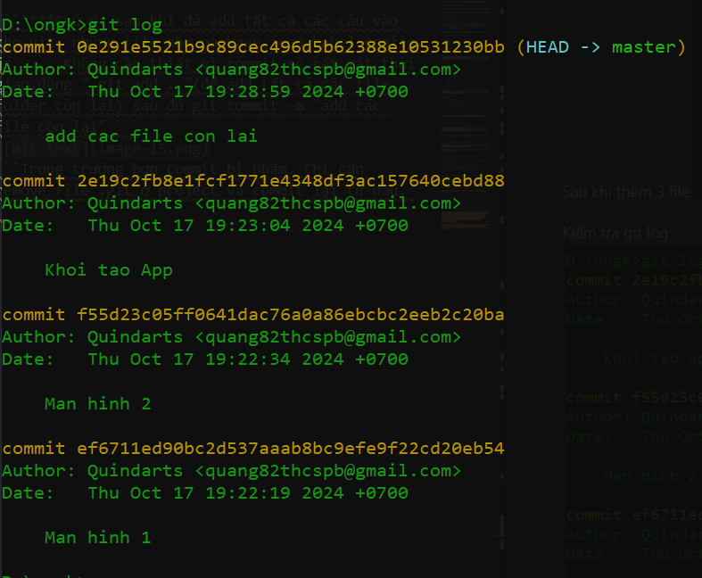

# 1. Setup project

### 1.1. Đăng nhập snack expo
Truy cập: [snack_expo](https://snack.expo.dev/)


Tạo snack : chọn New snack

### 1.2. Cài package
```javascript
{
  "dependencies": {
    "@expo/vector-icons": "^14.0.3",
    "react-native-paper": "4.9.2",
    "react-native-screens": "3.31.1",
    "@react-navigation/native": "^6.1.18",
    "@react-navigation/native-stack": "^6.11.0",
    "react-native-safe-area-context": "4.10.5"
  }
}
```
# 2. Folder structures & imports
Cấu trúc thư mục mẫu như sau:


### 2.1.Cách import fuction từ thư viện chính xác:

- B1: Đầu tiên import {} from "@react"


- B2: gọi function muốn get từ trong thư viện. Thư viện sẽ gợi ý sẵn tên hàm cụ thể


### 2.2 Ví dụ các function bắt buộc phải import:

```javascript
//TODO: Libs navigate - routing
import {createNativeStackNavigator} from "@react-navigation/native-stack"
import { NavigationContainer } from "@react-navigation/native";
import { useNavigation } from "@react-navigation/native";

//TODO: Libs của react
import {useState ,useCallback,useEffect, useContext,useReducer} from "react"

//TODO: Libs của react-native
import {View, Text,ScrollView,Image,TouchableOpacity ,FlatList} from "react-native"

//TODO: thư viện icon
import { FontAwesome } from '@expo/vector-icons';

```
### 2.3 Imports images và cách sử dụng:

Các bước import 1 file: 


Dể import file kéo thả file vào 


#### 2.3.1 Tạo 1 Image 


```javascript
<Image style={{
      width: 292,
      height:270,
      objectFit:'cover'
    }} source={require("../assets/bikmain.png")}/>
```
``source={require("../assets/bikmain.png")}`` : trỏ tới bikmain.png trong folder assets của expo

#### 2.3.2 Xử lý multi images:

- Bước 1: tạo 1 list image dạng

```javascript
const images = [
  require("../assets/bikmain.png"),
  require("../assets/bik_2.png"),
  require("../assets/bik_3.png"),
  require("../assets/bik_4.png"),
  require("../assets/bik_5.png")
]
```

- Bước 2: tạo 1 list data mẫu
```javascript
LIST = [
  {
    id: 1,
    name:"Bike pink",
    image: 1,
    price: 900,
    desc: "",
    type: "mountain"
  },
  {
    id: 2,
    name:"Bike black",
    image: 2,
    price: 100,
    desc: "",
    type: "mountain"
  }]
```
- Bước 3: ánh xạ 2 list

```javascript
<Image
        style={{
          width: 100,
          height: 100, 
          objectFit:'contain'
        }}
        source={images[image]}
      />
```

# 3. Export ZIP Expo project & Commit code


```Chọn icon download```

- Sau khi tải xong, Giải nén file và commit

### B1: tạo .git local và readme


Câu lệnh: 

```cmd
     git init
     echo Leminhquang>>README.md
```
### B2: check status file git

```cmd
     git status
```

### B3: Add từng file vào kho local git

- Chú ý: để nhanh thì có thể copy tên file ở danh sách git status

- Ví dụ mình sẽ commit Sc1.js => màn hình 1
- Ví dụ mình sẽ commit Sc2.js => màn hình 2
- Ví dụ mình sẽ commit App.js => khởi tạo app

```cmd
git add  components/Sc1.js
git commit -m "Man hinh 1"

git add  components/Sc2.js
git commit -m "Man hinh 2"

git add  App.js
git commit -m "Khoi tao App"

```
Kết quả:

Ban đầu


Sau khi thêm 3 file


Kiểm tra git log


```****Chú ý: sau khi đã add tất cả các câu vào kho git. những file như package.json,babel.config.js ,... Không cần thiết vì commit sẽ rất mất thời gian.dùng " git add . "(để add tất cả các file, folder còn lại) sau đó git commit -m "add các file còn lại" ```

```Trong trường hợp commit bị nhầm. Chỉ cần xóa file .git ở project và commit lại từ đầu. ```

### Kết quả file log cuối cùng



# 4. mockApi

[Link mockAPI](https://mockapi.io/)